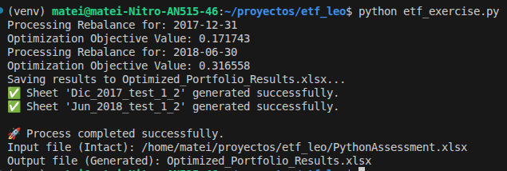

# ETF Portfolio Optimization Tool

Python tool for rebalancing and optimizing ETF portfolios using historical data.

## Features
- **Mean-Variance Optimization**: Calculates optimal weights for risk/return balance.
- **Automated Rebalancing**: Processes historical dates (2017-2018) automatically.
- **Safe Persistence**: Reads from Excel and generates a separate results file to prevent data corruption.

## Execution & Results
The tool processes the rebalancing dates and outputs the optimized weights to a new Excel file. Below is a successful execution log:



## Setup
1. Create a virtual environment: `python -m venv venv`
2. Activate it: `source venv/bin/activate`
3. Install dependencies: `pip install pandas openpyxl scipy`

## Usage
Run the main script:
```bash
python etf_exercise.py